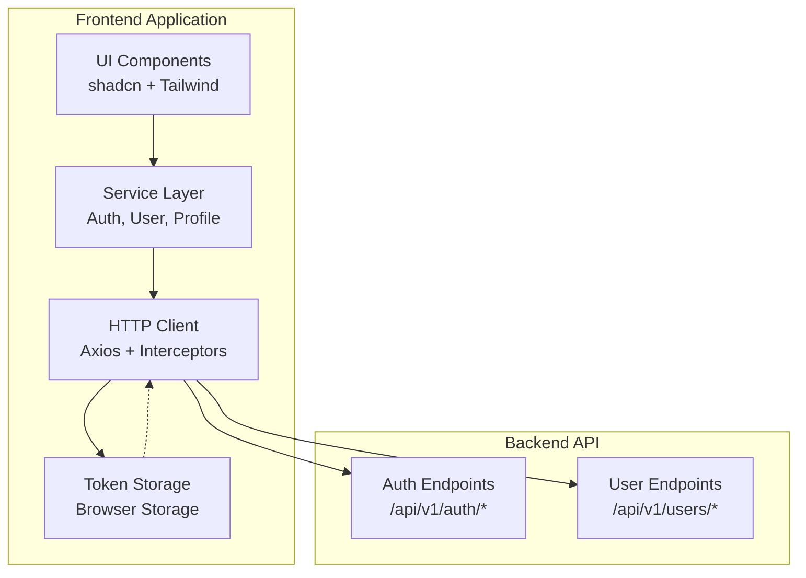
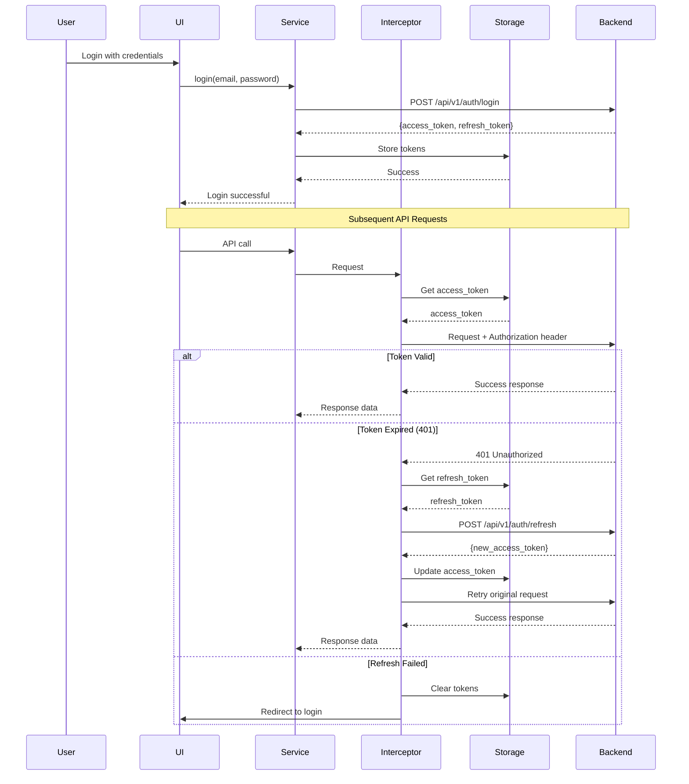

# Design Document: Frontend Setup

## Overview

This design document specifies the technical implementation for initializing a Next.js frontend application with TypeScript, Vite, and modern tooling. The application will integrate with an existing FastAPI backend to provide user authentication, registration, and profile management capabilities.

The frontend will be built using:
- **Next.js** as the React framework
- **TypeScript** for type safety
- **Vite** as the build tool for fast development
- **Tailwind CSS** for styling
- **shadcn** for accessible UI components
- **Axios** for HTTP client with interceptors
- **ESLint** for code quality

The design focuses on establishing a solid foundation with proper authentication flow, token management, and a scalable project structure that can be extended with file upload and storage features in the future.

## Architecture

### High-Level Architecture



### Authentication Flow



### Project Structure


```
frontend/
├── src/
│   ├── app/                    # Next.js app directory
│   │   ├── layout.tsx          # Root layout
│   │   ├── page.tsx            # Home page
│   │   └── globals.css         # Global styles
│   ├── components/             # React components
│   │   └── ui/                 # shadcn UI components
│   ├── lib/                    # Utility functions
│   │   ├── axios.ts            # Axios instance with interceptors
│   │   └── utils.ts            # Helper utilities
│   ├── services/               # API service functions
│   │   ├── auth.service.ts     # Authentication services
│   │   ├── user.service.ts     # User management services
│   │   └── storage.service.ts  # Token storage services
│   └── types/                  # TypeScript type definitions
│       ├── auth.types.ts       # Auth-related types
│       └── user.types.ts       # User-related types
├── public/                     # Static assets
├── .env.example                # Environment variable template
├── .env.local                  # Local environment (gitignored)
├── components.json             # shadcn configuration
├── eslint.config.js            # ESLint configuration
├── next.config.js              # Next.js configuration
├── package.json                # Dependencies and scripts
├── tailwind.config.ts          # Tailwind CSS configuration
└── tsconfig.json               # TypeScript configuration
```

## Components and Interfaces

### HTTP Client Configuration

The Axios HTTP client will be configured with base URL, timeout, and interceptors for authentication.

**File:** `src/lib/axios.ts`

```typescript
import axios, { AxiosInstance, InternalAxiosRequestConfig, AxiosResponse, AxiosError } from 'axios';
import { getAccessToken, getRefreshToken, setAccessToken, clearTokens } from '@/services/storage.service';

const API_BASE_URL = process.env.NEXT_PUBLIC_API_URL || 'http://localhost:8000';

// Create axios instance
const axiosInstance: AxiosInstance = axios.create({
  baseURL: API_BASE_URL,
  timeout: 10000,
  headers: {
    'Content-Type': 'application/json',
  },
});


// Request interceptor: inject access token
axiosInstance.interceptors.request.use(
  (config: InternalAxiosRequestConfig) => {
    const token = getAccessToken();
    if (token && config.headers) {
      config.headers.Authorization = `Bearer ${token}`;
    }
    return config;
  },
  (error) => Promise.reject(error)
);

// Response interceptor: handle token refresh on 401
let isRefreshing = false;
let failedQueue: Array<{ resolve: (value?: unknown) => void; reject: (reason?: unknown) => void }> = [];

const processQueue = (error: Error | null, token: string | null = null) => {
  failedQueue.forEach((prom) => {
    if (error) {
      prom.reject(error);
    } else {
      prom.resolve(token);
    }
  });
  failedQueue = [];
};

axiosInstance.interceptors.response.use(
  (response: AxiosResponse) => response,
  async (error: AxiosError) => {
    const originalRequest = error.config as InternalAxiosRequestConfig & { _retry?: boolean };

    if (error.response?.status === 401 && !originalRequest._retry) {
      if (isRefreshing) {
        return new Promise((resolve, reject) => {
          failedQueue.push({ resolve, reject });
        })
          .then(() => axiosInstance(originalRequest))
          .catch((err) => Promise.reject(err));
      }

      originalRequest._retry = true;
      isRefreshing = true;

      const refreshToken = getRefreshToken();
      if (!refreshToken) {
        clearTokens();
        window.location.href = '/login';
        return Promise.reject(error);
      }

      try {
        const response = await axios.post(`${API_BASE_URL}/api/v1/auth/refresh`, {
          refresh_token: refreshToken,
        });
        const { access_token } = response.data;
        setAccessToken(access_token);
        processQueue(null, access_token);
        return axiosInstance(originalRequest);
      } catch (refreshError) {
        processQueue(refreshError as Error, null);
        clearTokens();
        window.location.href = '/login';
        return Promise.reject(refreshError);
      } finally {
        isRefreshing = false;
      }
    }

    return Promise.reject(error);
  }
);

export default axiosInstance;
```


### Token Storage Service

The storage service manages authentication tokens in browser localStorage.

**File:** `src/services/storage.service.ts`

```typescript
const ACCESS_TOKEN_KEY = 'access_token';
const REFRESH_TOKEN_KEY = 'refresh_token';

export const setAccessToken = (token: string): void => {
  if (typeof window !== 'undefined') {
    localStorage.setItem(ACCESS_TOKEN_KEY, token);
  }
};

export const setRefreshToken = (token: string): void => {
  if (typeof window !== 'undefined') {
    localStorage.setItem(REFRESH_TOKEN_KEY, token);
  }
};

export const getAccessToken = (): string | null => {
  if (typeof window !== 'undefined') {
    return localStorage.getItem(ACCESS_TOKEN_KEY);
  }
  return null;
};

export const getRefreshToken = (): string | null => {
  if (typeof window !== 'undefined') {
    return localStorage.getItem(REFRESH_TOKEN_KEY);
  }
  return null;
};

export const clearTokens = (): void => {
  if (typeof window !== 'undefined') {
    localStorage.removeItem(ACCESS_TOKEN_KEY);
    localStorage.removeItem(REFRESH_TOKEN_KEY);
  }
};
```

### Authentication Service

The authentication service provides functions for login, logout, token refresh, and retrieving current user information.

**File:** `src/services/auth.service.ts`

```typescript
import axiosInstance from '@/lib/axios';
import { setAccessToken, setRefreshToken, clearTokens } from './storage.service';
import { LoginRequest, LoginResponse, RefreshRequest, RefreshResponse, User } from '@/types/auth.types';

export const login = async (email: string, password: string): Promise<LoginResponse> => {
  const response = await axiosInstance.post<LoginResponse>('/api/v1/auth/login', {
    email,
    password,
  });
  
  const { access_token, refresh_token } = response.data;
  setAccessToken(access_token);
  setRefreshToken(refresh_token);
  
  return response.data;
};

export const logout = async (): Promise<void> => {
  try {
    await axiosInstance.post('/api/v1/auth/logout');
  } finally {
    clearTokens();
  }
};

export const refreshToken = async (refreshToken: string): Promise<string> => {
  const response = await axiosInstance.post<RefreshResponse>('/api/v1/auth/refresh', {
    refresh_token: refreshToken,
  });
  
  const { access_token } = response.data;
  setAccessToken(access_token);
  
  return access_token;
};

export const getCurrentUser = async (): Promise<User> => {
  const response = await axiosInstance.get<User>('/api/v1/auth/me');
  return response.data;
};
```


### User Registration Service

The user registration service handles new user account creation with client-side validation.

**File:** `src/services/user.service.ts`

```typescript
import axiosInstance from '@/lib/axios';
import { RegisterRequest, RegisterResponse, User, UpdateProfileRequest, ChangePasswordRequest } from '@/types/user.types';

// Validation helpers
const validateEmail = (email: string): boolean => {
  const emailRegex = /^[^\s@]+@[^\s@]+\.[^\s@]+$/;
  return emailRegex.test(email);
};

const validatePassword = (password: string): boolean => {
  return password.length >= 6;
};

const validateName = (name: string): boolean => {
  return name.length >= 2 && name.length <= 100;
};

export const register = async (data: RegisterRequest): Promise<RegisterResponse> => {
  // Client-side validation
  if (!validateEmail(data.email)) {
    throw new Error('Invalid email format');
  }
  
  if (!validatePassword(data.password)) {
    throw new Error('Password must be at least 6 characters');
  }
  
  if (!validateName(data.name)) {
    throw new Error('Name must be between 2 and 100 characters');
  }
  
  const response = await axiosInstance.post<RegisterResponse>('/api/v1/users/register', data);
  return response.data;
};

export const getUserProfile = async (): Promise<User> => {
  const response = await axiosInstance.get<User>('/api/v1/users/profile');
  return response.data;
};

export const updateUserProfile = async (data: UpdateProfileRequest): Promise<User> => {
  // Only send fields that are provided (partial update)
  const updateData: Partial<UpdateProfileRequest> = {};
  if (data.name !== undefined) updateData.name = data.name;
  if (data.email !== undefined) updateData.email = data.email;
  
  const response = await axiosInstance.put<User>('/api/v1/users/profile', updateData);
  return response.data;
};

export const changePassword = async (data: ChangePasswordRequest): Promise<void> => {
  if (!data.current_password || !data.new_password) {
    throw new Error('Both current password and new password are required');
  }
  
  if (!validatePassword(data.new_password)) {
    throw new Error('New password must be at least 6 characters');
  }
  
  await axiosInstance.put('/api/v1/users/change-password', data);
};
```


### Configuration Files

**Tailwind Configuration** (`tailwind.config.ts`):

```typescript
import type { Config } from 'tailwindcss';

const config: Config = {
  darkMode: ['class'],
  content: [
    './src/pages/**/*.{js,ts,jsx,tsx,mdx}',
    './src/components/**/*.{js,ts,jsx,tsx,mdx}',
    './src/app/**/*.{js,ts,jsx,tsx,mdx}',
  ],
  theme: {
    extend: {
      colors: {
        border: 'hsl(var(--border))',
        input: 'hsl(var(--input))',
        ring: 'hsl(var(--ring))',
        background: 'hsl(var(--background))',
        foreground: 'hsl(var(--foreground))',
        primary: {
          DEFAULT: 'hsl(var(--primary))',
          foreground: 'hsl(var(--primary-foreground))',
        },
        secondary: {
          DEFAULT: 'hsl(var(--secondary))',
          foreground: 'hsl(var(--secondary-foreground))',
        },
        destructive: {
          DEFAULT: 'hsl(var(--destructive))',
          foreground: 'hsl(var(--destructive-foreground))',
        },
        muted: {
          DEFAULT: 'hsl(var(--muted))',
          foreground: 'hsl(var(--muted-foreground))',
        },
        accent: {
          DEFAULT: 'hsl(var(--accent))',
          foreground: 'hsl(var(--accent-foreground))',
        },
        popover: {
          DEFAULT: 'hsl(var(--popover))',
          foreground: 'hsl(var(--popover-foreground))',
        },
        card: {
          DEFAULT: 'hsl(var(--card))',
          foreground: 'hsl(var(--card-foreground))',
        },
      },
      borderRadius: {
        lg: 'var(--radius)',
        md: 'calc(var(--radius) - 2px)',
        sm: 'calc(var(--radius) - 4px)',
      },
    },
  },
  plugins: [require('tailwindcss-animate')],
};

export default config;
```


**shadcn Configuration** (`components.json`):

```json
{
  "$schema": "https://ui.shadcn.com/schema.json",
  "style": "default",
  "rsc": true,
  "tsx": true,
  "tailwind": {
    "config": "tailwind.config.ts",
    "css": "src/app/globals.css",
    "baseColor": "slate",
    "cssVariables": true
  },
  "aliases": {
    "components": "@/components",
    "utils": "@/lib/utils"
  }
}
```

**ESLint Configuration** (`eslint.config.js`):

```javascript
import { FlatCompat } from '@eslint/eslintrc';
import js from '@eslint/js';
import typescriptParser from '@typescript-eslint/parser';
import typescriptPlugin from '@typescript-eslint/eslint-plugin';
import reactPlugin from 'eslint-plugin-react';
import reactHooksPlugin from 'eslint-plugin-react-hooks';

const compat = new FlatCompat();

export default [
  js.configs.recommended,
  {
    files: ['**/*.ts', '**/*.tsx'],
    languageOptions: {
      parser: typescriptParser,
      parserOptions: {
        ecmaVersion: 'latest',
        sourceType: 'module',
        ecmaFeatures: {
          jsx: true,
        },
      },
    },
    plugins: {
      '@typescript-eslint': typescriptPlugin,
      'react': reactPlugin,
      'react-hooks': reactHooksPlugin,
    },
    rules: {
      '@typescript-eslint/no-unused-vars': ['error', { argsIgnorePattern: '^_' }],
      '@typescript-eslint/no-explicit-any': 'warn',
      'react/react-in-jsx-scope': 'off',
      'react-hooks/rules-of-hooks': 'error',
      'react-hooks/exhaustive-deps': 'warn',
    },
  },
];
```

**Environment Variables** (`.env.example`):

```
NEXT_PUBLIC_API_URL=http://localhost:8000
```


**TypeScript Configuration** (`tsconfig.json`):

```json
{
  "compilerOptions": {
    "target": "ES2020",
    "lib": ["ES2020", "DOM", "DOM.Iterable"],
    "jsx": "preserve",
    "module": "ESNext",
    "moduleResolution": "bundler",
    "resolveJsonModule": true,
    "allowJs": true,
    "strict": true,
    "noEmit": true,
    "esModuleInterop": true,
    "skipLibCheck": true,
    "forceConsistentCasingInFileNames": true,
    "isolatedModules": true,
    "incremental": true,
    "plugins": [
      {
        "name": "next"
      }
    ],
    "paths": {
      "@/*": ["./src/*"]
    }
  },
  "include": ["next-env.d.ts", "**/*.ts", "**/*.tsx", ".next/types/**/*.ts"],
  "exclude": ["node_modules"]
}
```

**Package.json** (key dependencies and scripts):

```json
{
  "name": "frontend",
  "version": "0.1.0",
  "private": true,
  "scripts": {
    "dev": "next dev",
    "build": "next build",
    "start": "next start",
    "lint": "eslint . --ext .ts,.tsx"
  },
  "dependencies": {
    "next": "^14.0.0",
    "react": "^18.2.0",
    "react-dom": "^18.2.0",
    "axios": "^1.6.0",
    "tailwindcss": "^3.4.0",
    "tailwindcss-animate": "^1.0.7",
    "class-variance-authority": "^0.7.0",
    "clsx": "^2.0.0",
    "tailwind-merge": "^2.0.0"
  },
  "devDependencies": {
    "@types/node": "^20.0.0",
    "@types/react": "^18.2.0",
    "@types/react-dom": "^18.2.0",
    "typescript": "^5.3.0",
    "eslint": "^8.55.0",
    "@typescript-eslint/parser": "^6.15.0",
    "@typescript-eslint/eslint-plugin": "^6.15.0",
    "eslint-plugin-react": "^7.33.0",
    "eslint-plugin-react-hooks": "^4.6.0",
    "autoprefixer": "^10.4.16",
    "postcss": "^8.4.32"
  }
}
```


## Data Models

### TypeScript Type Definitions

**Authentication Types** (`src/types/auth.types.ts`):

```typescript
export interface LoginRequest {
  email: string;
  password: string;
}

export interface LoginResponse {
  access_token: string;
  refresh_token: string;
  token_type: string;
}

export interface RefreshRequest {
  refresh_token: string;
}

export interface RefreshResponse {
  access_token: string;
  token_type: string;
}

export interface User {
  id: string;
  email: string;
  name: string;
  created_at: string;
  updated_at: string;
}
```

**User Types** (`src/types/user.types.ts`):

```typescript
export interface RegisterRequest {
  email: string;
  password: string;
  name: string;
}

export interface RegisterResponse {
  id: string;
  email: string;
  name: string;
  created_at: string;
}

export interface UpdateProfileRequest {
  name?: string;
  email?: string;
}

export interface ChangePasswordRequest {
  current_password: string;
  new_password: string;
}

export interface User {
  id: string;
  email: string;
  name: string;
  created_at: string;
  updated_at: string;
}
```

### API Response Formats

All API responses follow consistent formats:

**Success Response:**
```json
{
  "data": { /* response data */ }
}
```

**Error Response:**
```json
{
  "detail": "Error message"
}
```

**Validation Error Response:**
```json
{
  "detail": [
    {
      "loc": ["body", "email"],
      "msg": "Invalid email format",
      "type": "value_error"
    }
  ]
}
```


## Correctness Properties

A property is a characteristic or behavior that should hold true across all valid executions of a system-essentially, a formal statement about what the system should do. Properties serve as the bridge between human-readable specifications and machine-verifiable correctness guarantees.

### Property 1: Token Injection in API Requests

For any API request made through the HTTP client when an access token exists in storage, the request headers should include an Authorization header with the Bearer token format.

**Validates: Requirements 3.3**

### Property 2: Token Refresh on 401 Response

For any API request that receives a 401 Unauthorized response, if a valid refresh token exists in storage, the interceptor should attempt to refresh the access token by calling the refresh endpoint before retrying the original request.

**Validates: Requirements 3.4**

### Property 3: Consistent Error Formatting

For any API error response, the error should be formatted into a consistent structure that can be handled uniformly throughout the application.

**Validates: Requirements 3.6**

### Property 4: Token Storage on Successful Login

For any successful login response containing access and refresh tokens, both tokens should be stored in browser storage.

**Validates: Requirements 4.2**

### Property 5: Token Clearing on Logout

For any application state with stored tokens, calling the logout function should result in all tokens being cleared from storage.

**Validates: Requirements 4.4**

### Property 6: Registration Returns User Data

For any valid registration request that succeeds, the registration function should return user data containing at least the user's id, email, and name.

**Validates: Requirements 5.2**

### Property 7: Email Validation

For any string, the email validation function should accept strings matching the email format (containing @ and domain) and reject strings that don't match this format.

**Validates: Requirements 5.3**

### Property 8: Password Length Validation

For any string, the password validation function should reject passwords with fewer than 6 characters and accept passwords with 6 or more characters.

**Validates: Requirements 5.4**

### Property 9: Name Length Validation

For any string, the name validation function should reject names with fewer than 2 characters or more than 100 characters, and accept names within this range.

**Validates: Requirements 5.5**


### Property 10: Partial Profile Updates

For any profile update request, only the fields that are explicitly provided (not undefined) should be included in the API request payload.

**Validates: Requirements 6.4**

### Property 11: Password Change Validation

For any password change request, if either the current password or new password is missing, the function should reject the request with an error.

**Validates: Requirements 6.5**

### Property 12: Token Storage Round Trip

For any token string, storing it using setAccessToken or setRefreshToken and then retrieving it using the corresponding get function should return the same token value.

**Validates: Requirements 9.1, 9.2, 9.3**

### Property 13: Token Clearing Completeness

For any application state with stored access and refresh tokens, calling clearTokens should result in both getAccessToken and getRefreshToken returning null.

**Validates: Requirements 9.4**

## Error Handling

### HTTP Client Error Handling

The Axios interceptor implements comprehensive error handling:

1. **401 Unauthorized Errors:**
   - Automatically attempt token refresh using the refresh token
   - Queue concurrent requests during refresh to avoid multiple refresh calls
   - Retry original request with new token if refresh succeeds
   - Clear tokens and redirect to login if refresh fails

2. **Network Errors:**
   - Propagate network errors to calling code
   - Allow components to display appropriate error messages
   - Maintain error context for debugging

3. **Validation Errors (400):**
   - Parse validation error details from backend
   - Format errors for display in UI forms
   - Preserve field-level error information

4. **Server Errors (500+):**
   - Propagate server errors to calling code
   - Log errors for monitoring
   - Display generic error message to users

### Service-Level Error Handling

Each service function implements validation and error handling:

1. **Authentication Service:**
   - Validates credentials before API calls
   - Handles token storage failures gracefully
   - Clears tokens on logout even if API call fails

2. **User Service:**
   - Validates email format client-side
   - Validates password length client-side
   - Validates name length client-side
   - Throws descriptive errors for validation failures

3. **Storage Service:**
   - Checks for browser environment before accessing localStorage
   - Returns null for missing tokens instead of throwing errors
   - Handles localStorage quota exceeded errors

